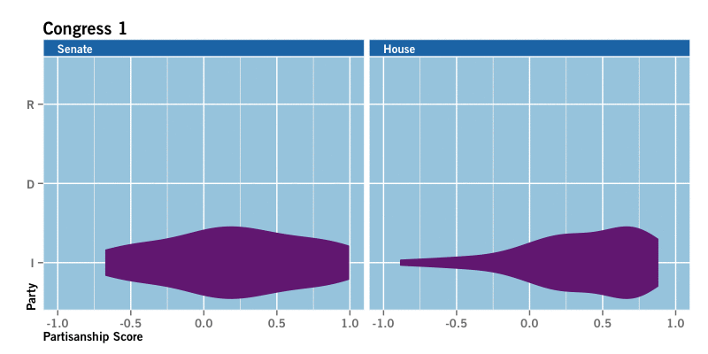

US Congress Partisanship Animation
==================================

What is this?
-------------
This is the data, R script, and documentation necessary to make an animation of
partisanship in the US Congress, with parallel violin plots of the House and
Senate across Congresses 1 to 113 broken down by party. This is merely a data 
visualisation of Poole and Rosenthal's DW-NOMINATE work, and not an analysis of 
raw data.

Where does this start?
----------------------
All credit for data goes to Poole and Rosenthal, and their excellent work on 
DW-NOMINATE scores. Data was obtained from their http://www.voteview.com, with 
relevant downloads copied here. VoteView.com seems to be somewhat in flux, but 
further documentation about the data should still be available there without 
too much searching.

The script uses the 1st dimension coordinate, which is, according to the 
authors, the only one relevant after the Civil War. If you're particularly 
interested in the data from early Congresses, it would make a lot of sense to 
rebuild the script to account for the second dimension and rebuild the party 
decoder to account for early political parties.

What does this do?
------------------
The operant file is the R script "partisansihp.R", which imports the included 
data, modifies it as necessary, makes the plots in a new folder called 
"PartisanshipAnimation", and then calls ImageMagick to compile the plots into 
an animated .gif file, which is saved in the same new file.

What are the results?
---------------------
This .gif of partisanship in the US Congress:

The output is named "partisanship.gif", and is in the "PartisanshipAnimation" 
file, pre-compiled here. Also in that file is a smaller version of the 
animation, dithered with unnecessary colors removed via online tools at 
http://ezgif.com/optimize. "giphy.txt" includes links for an uploaded copy of 
the .gif on giphy.com.

What do I need to run the script myself?
----------------------------------------
R, to start (http://www.r-project.org/). To run the script, you'll need the 
following packages (all available from CRAN):

- xlsx
- foreign
- ggplot2
- dependencies of those packages (usually automatically installed).

You'll also need ImageMagick to compile the animated .gif. It is available free 
at http://www.imagemagick.org, and can be installed via MacPorts or Homebrew on 
OS X. You only need a command-line install, not a GUI version.

The script uses Linotype's Trade Gothic Bold No. 2, available for a fee at 
http://www.fonts.com/font/linotype/trade-gothic/bold-2. You are also welcome to 
change the relevant code on line 71 of partisanship.R to whatever font you like.

Notes on the script
-------------------
As any regular R user will quickly see, the R script is assembled with a couple 
major functions and a good bit of other code more akin to usage typical of 
interactive use of R. Given the dependencies, the script is written to be 
platform-independent (you shouldn't need to update paths or anything). At 
some point in the future I may rewrite it in a more completely functional 
paradigm, but I think it's pretty easy to see what's happening as-is, despite the 
mixed paradigms.
